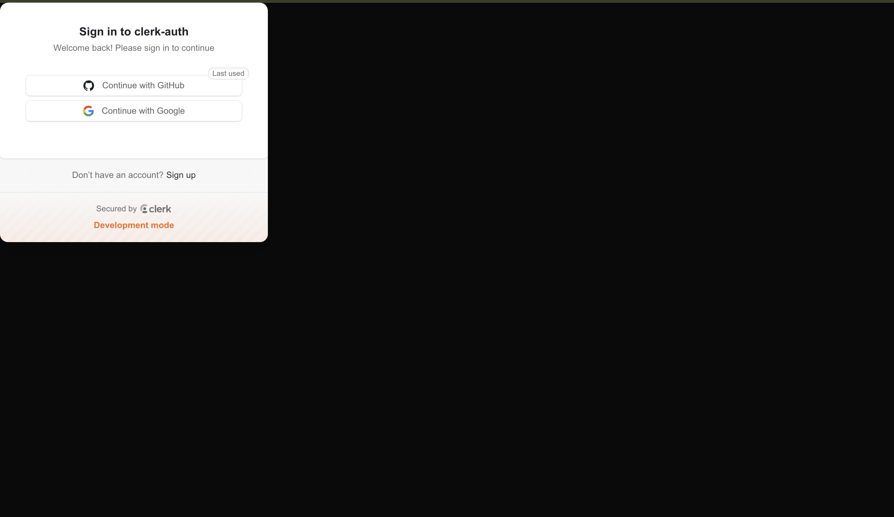
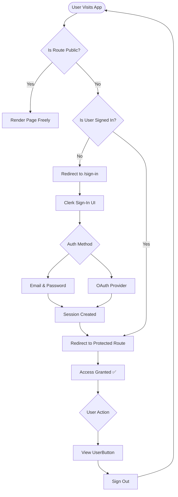

# 🔐 Clerk Auth — Next.js Authentication App

A minimal yet production-ready authentication app built with **Clerk** and **Next.js 16**, featuring out-of-the-box sign-in/sign-up flows, route protection via middleware, and the React Compiler for optimized rendering.

---

> Visit [Clerk Auth App](https://better-auth-gmarav05.vercel.app/login)

`Next.js` `React` `Clerk Auth` `Shadcn UI` `Tailwind CSS`

## Live Demo


https://github.com/user-attachments/assets/e79b26cb-9ea4-4048-ae6a-e1d14ac99f58


## Screenshot 

<div style="display: flex; justify-content: center; gap: 20px;">  
</div>


## 🗺️ Auth Flow Diagram



---

## 🧰 Tech Stack

| Category | Technology | Version |
|----------|-----------|---------|
| **Framework** | Next.js | 16.1.6 |
| **UI Library** | React | 19.2.3 |
| **Authentication** | Clerk (`@clerk/nextjs`) | ^6.38.3 |
| **Styling** | Tailwind CSS | ^4.0 |
| **Compiler** | React Compiler (Babel plugin) | 1.0.0 |
| **Linting** | ESLint + eslint-config-next | ^9 / 16.1.6 |
| **Deployment** | Vercel | — |

---

## 📁 Project Structure

```
clerk-auth/
├── app/
│   ├── globals.css             # Global styles with Tailwind v4
│   ├── layout.js               # Root layout with ClerkProvider
│   ├── page.js                 # Home page — displays UserButton
│   ├── sign-in/
│   │   └── [[...sign-in]]/
│   │       └── page.js         # Clerk hosted Sign-In UI
│   └── sign-up/
│       └── [[...sign-up]]/
│           └── page.js         # Clerk hosted Sign-Up UI
├── public/                     # Static assets
├── proxy.js                    # Clerk middleware — route protection
├── next.config.mjs             # Next.js config (React Compiler enabled)
├── postcss.config.mjs          # Tailwind CSS PostCSS setup
├── eslint.config.mjs           # ESLint flat config
├── jsconfig.json               # Path alias (@/*)
└── package.json
```

---

## 🚀 Getting Started

### 1. Clone & Install

```bash
git clone <your-repo-url>
cd clerk-auth
npm install
```

### 2. Set Up Clerk

Create a project at [clerk.com](https://clerk.com), then grab your API keys.

### 3. Configure Environment Variables

Create a `.env.local` file in the project root:

```env
NEXT_PUBLIC_CLERK_PUBLISHABLE_KEY=pk_test_...
CLERK_SECRET_KEY=sk_test_...

# Optional: Custom redirect paths
NEXT_PUBLIC_CLERK_SIGN_IN_URL=/sign-in
NEXT_PUBLIC_CLERK_SIGN_UP_URL=/sign-up
NEXT_PUBLIC_CLERK_AFTER_SIGN_IN_URL=/
NEXT_PUBLIC_CLERK_AFTER_SIGN_UP_URL=/
```

### 4. Run the Dev Server

```bash
npm run dev
```

Open [http://localhost:3000](http://localhost:3000) to see the app.

---

## 🔒 Route Protection

Route protection is handled by Clerk's middleware in `proxy.js`. Public routes (`/sign-in` and `/sign-up`) are open to everyone; all other routes are automatically protected.

```js
// proxy.js
const isPublicRoute = createRouteMatcher(['/sign-in(.*)', '/sign-up(.*)'])

export default clerkMiddleware(async (auth, req) => {
  if (!isPublicRoute(req)) {
    await auth.protect()
  }
})
```

Any unauthenticated user hitting a protected route is redirected to `/sign-in` automatically.

---

## 👤 Accessing the Current User

On the server, use `currentUser()` from `@clerk/nextjs/server`:

```js
// app/page.js
import { currentUser } from "@clerk/nextjs/server";

export default async function Home() {
  const user = await currentUser();
  return <div>Hello, {user?.firstName}!</div>;
}
```

On the client, use Clerk's `useUser()` hook:

```js
"use client";
import { useUser } from "@clerk/nextjs";

export default function Profile() {
  const { user } = useUser();
  return <div>{user?.emailAddresses[0]?.emailAddress}</div>;
}
```

---

## ⚡ Key Features

**Clerk-Powered Auth** — Full sign-in/sign-up/session management with zero backend code. Supports email/password, OAuth, magic links, and more out of the box.


**Middleware Route Protection** — Every non-public page is protected at the edge before React even renders, preventing flash-of-unauthenticated-content.

**React 19 + React Compiler** — The project uses React 19.2.3 alongside the experimental React Compiler (`babel-plugin-react-compiler`) for automatic memoization and optimized renders.

**Tailwind CSS v4** — Utility-first styling with the new CSS-native v4 pipeline via `@tailwindcss/postcss`.

---

## 📚 Learnings

- **Clerk's `[[...sign-in]]` catch-all routes** allow Clerk to handle multi-step auth flows (OAuth callbacks, MFA, etc.) under a single route segment.

- **`clerkMiddleware` vs `authMiddleware`** — The newer `clerkMiddleware` API gives granular control over which routes are public and is the recommended approach in Clerk v6+.
- **React Compiler** auto-optimizes components without manual `useMemo`/`useCallback`, but still requires careful attention to side effects.
- **Tailwind v4** drops the `tailwind.config.js` in favor of CSS-first configuration, making setup leaner.

---

## 🌐 Deployment

This app is designed for deployment on **Vercel**. After pushing your repo:

1. Go to [vercel.com](https://vercel.com) and import the project.

2. Add your environment variables (`NEXT_PUBLIC_CLERK_PUBLISHABLE_KEY`, `CLERK_SECRET_KEY`) in the Vercel dashboard.
3. Deploy — Vercel handles the rest.

---

## 🙏 Acknowledgements

- [Clerk](https://clerk.com) — Authentication infrastructure that just works
- [Next.js](https://nextjs.org) — The React framework for production
- [Tailwind CSS](https://tailwindcss.com) — Utility-first CSS framework
- [Vercel](https://vercel.com) — Effortless deployment platform
